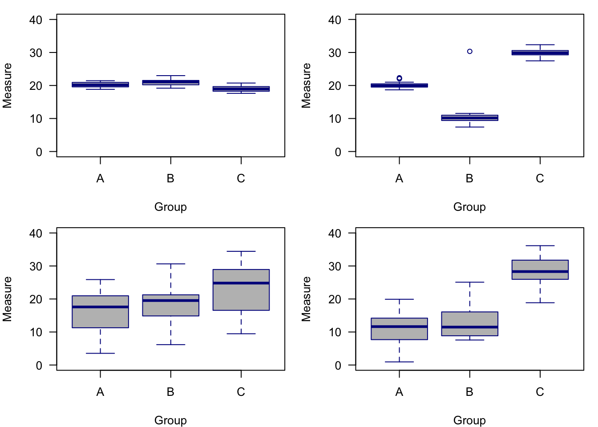

```{r setup, include=FALSE}
knitr::opts_chunk$set(echo = F)
```

# Data Analysis in R

https://bookdown.org/steve_midway/DAR/from-science-to-data.html

## Chapter 1 From Science to Data

`Experiments` Experiments are the hallmark of strong inference, because they isolate experimental units, manipulate treatments, and include randomization, replication, and controls. This ability to engineer and isolate factors of interest tends to advance understanding by decluttering from other potential factors.

`Observations` Observations take place when a patter or process is observed and often parsed apart into some measured outcome (or response) and measured input(s). Outcomes and inputs can really only be measured and no manipulated in an expermental sense.

`Process error`, which is the error we tend to assume most errors will be. Process error concerns the errors that arise from imperfections in our understanding of the system we are trying to model. 

`Observation error`. Observation error are those errors resulting from imperfections in how we measure and record the systems and relationships we seek to describe. 

There is always a need to independently `replicate` the science that’s done in order to approach some asymptote of certainty regarding the results.

In lieu of replication, `reproducibility` has emerged as a compromise between true replication and doing nothing. Reproducibility concerns the ability of a reader to reproduce the analysis of a study. Another way to think about reproducibility would be validating the data analysis. Obviously this is not a full replication; however, including code, data, and even linked code and data can create the opportunity for the reader to reproduce the analysis that the authors have shared

1. Agree we can *discover and agree* on knowledge
2. Make *observations* of how something works
3. Develop *multiple competing hypotheses*
4. *Falsify* or support hypotheses until agreement
5. Use *strong inference *when possible to support leading hypotheses
6. Further refine knowledge experiments and *descriptions of error*
7. Share your work so that the study could be replicated and the analysis could be *reproduced*

## Chapter 2 Learning R

R is a command-line programming language that is not a statistical software per se, but certainly has statistical applications. R was first written in 1993 by Ross Ihaka and Robert Gentleman at the University of Auckland, New Zealand, and was built off the S programming language.

`Command-line programming` means that the user enters strings of text into a command-line interface that are then read and executed by a program. 

R has options for `integrated development environments` (IDEs), including R Studio. R Studio is an IDE that integrates the command-line experience of R with other organizational components, such as panels to view plots, quick access to help files, and a script editor,

## Chapter 3 Working with Data

The three rules for tidy data include

1. Each variable forms a column.

2. Each observation forms a row.

3. Each type of observational unit forms a table.

Opening your R script from that file will set up your working directory to be that same folder (which R calls the working directory), in which the data are also stored. This will alleviate the need to specify file paths and other things that simply add code, create chances for error, and make code less collaborative.

`Metadata` is a set of data that describes and gives information about the data. 

It contains the information that applies to all the data but isn’t replicated in the actual data file. 

This information includes:

1. The person recording and/or imputing the data if there are two different people.

2. The date of the recording.

3. The source of the data, if it was not collected by you or is not clear who collected it.

4. A general time and location such as the date or month or year and the location in which the data were collected, if this information is not included in the data file.

5. Specific descriptions of all the column names as well as the column data types. This is often referred to as the data dictionary, and can be a stand-alone file. For example you may have a column name called DgF and it’s wise in the metadata to define this as degrees Fahrenheit. Then, within that degrees Fahrenheit column you would have data types that are numeric or integer based on the resolution of recording.

6. Include units. Units may be included subtly within the column names (a good idea); however, it’s really important to include the unit types within the metadata at least as a backup. You will likely find yourself abbreviating things in the data, which is fine, but use the metadata to define and explain the abbreviations.

7. A description of how missing elements are notated. Are missing elements of data notated with an NA, or a 99 , or a dash, or a blank cell? All of these are ways that people have indicated missing elements. Generally speaking it is best to leave a cell blank if there’s missing information, but regardless of what you choose just make sure you include it in the metadata.

## Chapter 4 Exploratory Data Analysis


1. Formulate your question
2. Read in your data
3. Check your “n”s

Visually Exploring Your Data

Not from the perspective of making highly-detailed and aesthetically-effective plots, but from the perspective of making plots that accurately show the data and relationships we want to explore.

Making Comparisons

`Specificity` Be specific in your comparisons. Making vague or general statements only opens the door for latent effects to cause trouble when not accounted for. For example, if you want to explore plots that support your hypothesis that The Mississippi River Plume has high species diversity, consider what is meant by high species diversity? What is the reference for low species diversity? Are you comparing the plume diversity to other plumes? To areas outside of plumes?

`Causality` Consider underlying causality or mechanism. Simply because two variables have a relationship does not mean they are actually influencing each other. Along this line, manipulation of plot axes and other graphical parameters can trick viewers into interpreting more than might be there. Remember the expression correlation is not causation.

`Bar plots` are reserved primarily for count data, or data that shows some accumulation (or proportion). Bar plots are not the proper plot type for distributional data or data that is showing estimates (e.g., means) and uncertainty.

```
# Tabulate earthquakes by magnitude
magnitude.counts <- table(quakes$mag)
# plot counts of earthquakes by magnitude
barplot(magnitude.counts,
        xlab = "Magnitude",
        ylab = "Frequency",
        las = 1,
        col = "black")
```

Histograms are are the quintessential exploratory plot because they show densities of data and can help provide distributional information. Histograms may end up in a final analysis, but they are much more likely to be found in your exploratory code where you are trying to understand the range and density of different variables. Histograms are used on numerical data that the `histogram()` function will automatically bin, although you can specify the resolution of the bins by modifying the `breaks =` argument.

```
# Histogram of the heights of black cherry trees
hist(trees$Height,
     las = 1, # rotate numbers on y-axis
     col = "brown", # black bars
     border = "white", # white border
     main = '', # Leave the title empty (use caption)
     breaks = 10, # 10 bins
     xlim = c(60,90), # Range of x-axis
     xlab = "Black Cherry Tree Height") # y-axis label
```

Scatterplots are particularly useful for considering how your variable `y`  changes across values of  `x`, and your observations here may directly inform a model you want to evaluate with your data.

```
# Scatterplot of Black Cherry Tree Height and Volume
plot(trees$Volume ~ trees$Height, # The plot in formula syntax; y ~ x
     xlim = c(60,90), # Range of x-axis
     ylim = c(0,100), # Range of y-axis
     pch = 19, # Plotting symbol change to filled-in circle
     xlab = "Height", # x-axis label
     ylab = "Volume", # y-axis label
     las = 1) # Rotate numbers on y-axis
```

`Boxplot` show distributional information for data. Typically the box represents the IQR (interquartile range), the center line represents the median, and the whiskers represent some extreme of the data. However, one mistake that is often made with boxplots is that the boxplot features are not described in the figure caption. You might not be captioning all your exploratory plots, but for final renderings, be sure to state what the box represents, what the whiskers represent, and so on. It might be obvious to you, but boxplot symbology is not universal!

Relatives of box plots, like the violin plot, may be more appropriate for non-normal data because it can capture more of the shape of the data

```
# Boxplot of ozone by month for New York
boxplot(airquality$Ozone ~ airquality$Month,
        xlab = "Month", # x-axis label
        ylab = "Ozone", # y-axis label
        las = 1, # Rotate numbers on y-axis
        ylim = c(0,200), # Range of y-axis
        col = "lightblue", # Boxplot fill color
        border = "darkred", # Boxplot border color
        pch = 19) # Symbol for outliers
```

A `line plot` is almost always a model. Models may be exploratory, but they are not data. Lines representing models are interpolating (or extrapolating) your data, and that is a different from simply evaluating the data on its own. Having said this, adding reference lines or other annotations is encouraged, so long as it is clear what is added and why.

### Data Manipulation

 In `dplyr` functions, the focus is on data frames, which is the object on which the functions are performed. dplyr provides often simplified functions that are typically faster performing, especially as data frame objects increase in size. dplyr refers to their commands as verbs, which you should know, although you will also see them refered to as commands and functions. Finally, `dplyr` is the successor of the `plyr` package.

`select` subsets columns.

```
library(dplyr)

# Select by column order
head(dplyr::select(iris, c(2,4)))

# Select by column name
head(dplyr::select(iris, c('Sepal.Width','Petal.Width')))

# Select by column name criteria
head(dplyr::select(iris, ends_with('Width')))

# To save output as object
# iris_new <- select(iris, ends_with('Width'))

```
`Filter` is a verb for subsetting based on criteria, much like subset().


```
# Filter for only virginica species
head(filter(iris, Species == 'virginica'))

# Filter for only Petal.Width greater than 2.0
head(filter(iris, Petal.Width > 2.0))

# Filter for only Petal.Width greater than 2.3
# and the virginica species
head(filter(iris, Petal.Width > 2.3 & Species == 'virginica'))

```

`arrange` is a verb for reordering row(s).

```
# Arrange by Sepal.Length
head(arrange(iris, Sepal.Length))

# Arrange by Sepal.Length decreasing
head(arrange(iris, desc(Sepal.Length)))

```

`rename` is a verb for renaming columns.

```
# Rename Species column in iris
head(rename(iris, sp = Species))


```

`mutate` computes and transformation of variables.

```
# Rename Species column in iris
head(mutate(iris, Petal_condition = Petal.Length/Petal.Width))


```

`group_by` groups for summary statistics; often used with `summarize()`

```
# Rename Species column in iris
group_by(iris, Species)
```
`%>%` is called the pipeline operator, and it strings together verbs so that multiple different (but sequential) manipulation steps can happen in one expression. Data frames do not need to be specified within a pipeline operator once they are introduced.

```
# Get mean condition for each species
iris %>%
  mutate(Petal_condition = Petal.Length/Petal.Width) %>%
  group_by(Species) %>%
  summarize(
    cond = mean(Petal_condition)
  )
```

## Chapter 5 Models and Estimation

Model is perhaps the most used term in a statistical context, and its continued reference and importance are warranted because the model you are using represents your idea of the system, process, or relationship you are seeking to describe. (Although system, process, and relationship are all appropriate ways to think about a model, I will generally adopt the term system.) If you have an accurate model for your system, then you will have a better idea of the quality of your data, the inference of your parameters, and generally get much farther in your analysis. If your model is flawed to the point of not being accurate enough to be useful, then your analysis will at best be incorrect but runs the risk of being misleading. When we think about incorrect models in ecology, sometimes the stakes are not that high, but consider a misleading model for a cancer drug treatment, or some other application where human lives are involved. We all want to use a good model, but we must also realize that models are only representations of (often complex) systems, and cannot be perfect. It’s overstated in statistical ecology, but still correct, that   All models are wrong, but some are useful.’’ (–George Box?)

When talking about a statistical model, it’s important to first distinguish it from a mathematical model. A simple way to remember the difference between a mathematical model and statistical model is that a mathematical model does not contain a term (parameter) for error. When a mathematical model is expressed, we can solve for a term and know what that term is or what it could be (if more than one possible answer exists). For example, `5=2+x` would suggest that `x=3 `. However, a statistical model includes a term for error because we are describing a system that is not perfectly known and for which some uncertainty exists. A useful way to conceptualize a statistical model is to think about the left side of the equation as the response and the right side of the equation as the combination of the deterministic part of the system plus the stochastic part of the system. The deterministic part of the system is the model, or the relationship you are seeking to test or confirm. The stochastic part of the system is the random error or deviations from the relationship that are unexplained by the model.

A simple description of a statistical model:

`response = deterministic + stochastic`

 there are variables we don’t even know about or cannot measure. This uncertainty in the system is what results in random error—or the stochastic part of the model that captures the deviations from the expected relationship. It is perfectly reasonable and expected to have random error in a statistical model, but it is also appropriate to think about how that error is generated, what it looks like, and how we can minimize it while still acknowledging it

The deterministic part is simply how we perceive the system or relationship to work. In a simple linear regression model, we would expect that the increase in  x  results in some change in  y , and that this change is constant across all values of  x. (If the change is not constant, we can still find a model for that, but it might not be simple linear regression.) The description of the model takes place using terms called parameters and mathematical operators (e.g., addition and subtraction). Parameters are unobservable, but we can still estimate them and their effects by using the data we have

We want a model to be general enough that it contains truths and can be applied elsewhere, but not so general that it does not advance our understanding of the system. Similarly, we want enough model complexity such that our model is not overrun with error or too simplistic, but we also want to avoid using a model that is to complex that it becomes a product of its own data and is not useful for any other purposes.

You may hear models that are too general referred to as *underparameterized*, and models that are too complex as *overparameterized*

Model selection is a term you hear frequently used in statistics. Model selection has become very popular over the last few decades largely due to new techniques and software that are able to explore a large number of models. But it remains important to consider what the goal of model selection is. Is your goal prediction, for example predicting unobserved information? Or is your goal understanding, as in understanding relationships within the data you’ve already collected? It remains important to remember that model selection occurs on the front end, too, and may not be an explicit test you run on the data, but simply exercising discretion in which terms you decide to include in the first place.

Estimation

A number of different estimation types exist within statistics; however, will cover three common estimation types here.

1. The first estimation type is perhaps the least frequently used and is called Monte Carlo estimation, or sometimes bootstrapping or resampling. This is an estimation type which requires very few assumptions and uses the observed data over and over to draw inferences.

2. The second type of estimation is the most common and is referred to as frequentist estimation or Fisherian estimation (after R.A. Fisher). Frequentist estimation assumes a parametric distribution and is interested in the long run of frequencies within the data. Most statistical software that don’t specify otherwise default to using some type of frequentist estimation—typically least squares or maximum likelihood.

3. The third and final type of estimation that will cover here is called Bayesian estimation. Bayesian estimation is actually centuries old but has been revitalized in the past few decades because of the computational complexity that is required to estimate in a Bayesian framework. Bayesian inference is also assume a parametric distribution. Bayesian estimation includes a prior distribution or prior knowledge about the parameter.

###  Monte Carlo Estimation

Consider a null hypothesis which is defined as the pattern in the data being no different from what is occurring in nature. After we collect data, we develop a test statistic, and then randomize the data and generate a large number of test statistics from the randomized data. All of the randomized test statistics create a null distribution, which we then used to compare to our observed test statistic.

 In order to run the estimation we need to run a number of simulations. The number of simulations may range from hundreds to millions and largely depends on the complexity of the data and the computational power available. However, for each simulation the approach is the same. Each simulation randomly assigns all 12 observations in the data to one of two groups. This random assignment between groups is meant to simulate the null hypothesis that any of the observations could be coming from either group because there are no differences between groups.

###  Frequentist vs Bayesian

Frequentist approaches can be thought of as asking “What is the probability of the data that I observed compared to a fixed and unknowable parameter(s).” 

Bayesian estimation provides the opposite interpretation, asking “What is the probability of certain parameter values based on the data I observed.” 

The frequentist paradigm:

1. Assume that data are repeatable random variables.

2. Assume that parameters do not change and are often referred to as fixed and unknowable.

3. All experiments are considered to be independent in the sense that no prior knowledge can be (directly) provided to a parameter estimate or model.

4. Frequentist this outcomes are driven by point estimates and ultimately is null hypothesis driven in the sense that we accept or reject hypotheses and outcomes.

5. *p-values* are a key outcomein frequentist estimation.

Bayesians:

1. Assume that the data are fixed; in other words, the data are the things that are knowable and parameters are random variables that we are seeking to estimate (based on the known data).

2. Adopt a degree-of-belief from probability.

3. Can update beliefs in the sense that prior information can be used to directly inform the estimate of certain parameters.

4. Bayesian estimation is driven by distributions and uncertainty (as opposed to point estimates). 

5. Outcomes are not required to accept or reject anything based on a critical value; instead probabilistic interpretations of outcomes are generated that may not distill to a simple yes or no but may in fact be more realistic to the question at hand.

Put another way the frequentist asks “The world is fixed and unchanging; therefore, given a certain parameter value how likely am I to observe the data that supports that parameter value?”

While the Bayesian asks “The only thing I can know about the changing world is what I observe; therefore, based on my data what are the most likely parameter values I could infer.”

### Why the frequentist popularity?

Frequentist approaches are often operationalized within simple point and click routines and they do not require much computational power.

As you may learn Bayesian approaches can often require a lot of computational power making them challenging to implement (until the advent of modern computers).

Frequentist approaches or largely developed by R.A. Fisher who also popularized the analysis of variance or ANOVA. Although ANOVA is a model that can be estimated using different estimation techniques it does help your cause when an incredibly useful model is developed in parallel to an estimation routine

Finally *p-values* have also helped the popularity of frequentist approaches. Although you may have questioned p-values yourself or read articles about concerns with using p-values, the reality for many people is that an accept reject framework remains simplistically attractive for interpreting outcomes.

### The problem with p-values

As convenient as p-values may be there are a number of problems with them. These problems are increasingly being cited and reported, and whether you use p-values or not you should be aware of them. 

First off p-values are oftentimes not intuitive and can be hard to explain. 

Second, a p-value does not indicate whether a result is correct or not, nor does it provide information about the magnitude of an effect. p-values really just provide a binary interpretation of something, yet in many instances we don’t want a binary interpretation or we make inferences on the p-values number that are not accurate to be made.


### Maximum Likelihood

For frequentist estimation we often use maximum likelihood estimation, or MLE. MLE maximizes the log function by minimizing the negative log likelihood. R does this for you but you’re encouraged to know how it is done and the numerous variants of MLE that may be used in different models. For instance least squares estimation is simply minimizing the sum of squared errors and is a simpler version of MLE. And if a linear model has normal errors, we call MLE OLS, or ordinary least squares.

### Bayesian Estimation

Bayesian estimation requires a bit more in terms of the mechanics. The basis for Bayesian inference is Bayes rule which includes a term for the posterior distribution the likelihood function the prior distribution and a normalizing constant.

$$p(\theta|y)=\frac{p(y|\theta)p(\theta)}{p(y)}$$

$$Posterior = \frac{Likelihood \times Prior}{Normalizing Constant}$$


The posterior distribution is really just another way of saying the result. The posterior distribution is the outcome of our estimation, but because it is in the form of a distribution and not a point estimate we call it a distribution. The likelihood function can be a number of different likelihood functions but is often very similar to maximum likelihood and this is a shared feature with frequentist estimation. The prior distribution is the ability to add existing parameter information to a model. For instance you may know that a parameter estimate needs to fall within a certain range of values. The priority distribution is one option you have to implement that prior information before the model begins to estimate the parameters. Finally the normalizing constant is something that, to simplify, allows the results of the estimation to be interpreted in a probabilistic framework.

# Analysis

## Chapter 6 The Linear Model

Terms used in linear modeling are not standardized, but for the most part they are consistent. Below are some definitions and discussion about terms that will appear in this text, or terms that may be helpful to be aware of.

`units` – observations or data points, often indexed with i
 
`x`  variable – predictors or independent variables in the model that are included on the right side of the model equation

`y`  variable – outcome, response, or dependent variable in the model that is typically the lone term on the left side of the model equation

`inputs` – also called model terms, these are the items on the right side of the model equation; note that while inputs and predictors are often the same thing, they are not technically the same as you can have more inputs in the model than you can have predictors. Predictors refer to the actual independent variables, so for example a model with two predictors could have three inputs if the third input is an interaction terms between the two predictors

`residual error` – typically the final term on the right side of the model equation that is included to account for any unexplained information

`multiple regression` – regression including more than one predictor; also refered to as multivariable regression, and not to be confused with multivariate regression (e.g., MANOVA, PCA, etc.)

### Components of the Linear Model

```
response = deterministic + stochastic

outcome = linear predictor + error

result = systematic + chance
```


As you can see, based on any of the three descriptions, the measured response is on the left side and it is this response that we are trying to understand with predictor variables. On the right side of the equation we have two components: something predicable and something not predicable. 

The deterministic part is often called the linear predictor and this is where the independent variables and their parameters will live and work

But because the independnent variables will never explain 100% of the response (and if they do, you are not working with a statistical model), we also need to include a term for an unexplained information. This unexplained information is often called residual error.

Coding a linear model into R is not difficult. The `lm()` function can be used, inside which you specify the left and right side of your model separated by `~`. But where is the error term? The error term is estimated, but not specified. Simply by using the `lm()` function, R knows this is a linear model and that error needs to be accounted for, and the residual error will be included in the model summary.

```
lm(y ~ x) # where is error term?
lm(y ~ x1 + x2 + x3) # Model inputs are included by simply adding them
```
###  The Response Component

The response is simply the dependent variable you observed and which you are hypothesizing is a function of the predictor variables you also observed. From a mechanical standpoint, the response variable is simply a vector of observations that are often referred to as `y`  and can be included in your model as the lone vector of data on the left side of the formula or equation.

### The Stochastic Component

All statistical models have some error or residual variance that represents observed information that is not accounted for by the predictors or inputs. This stochastic component is directly related to the response variable through a distribution. That is, all data we observe (or the vast majority of data we observe) are thought to have come from some underlying distribution. 

The correct underlying distribution for our model will put in place the correct machinery to describe the response variable and capture the residual error. The normal distribution is very common distribution both in the world and in linear modeling, but there are many other distributions to be aware of and which may be at play in your data.


1. `Know your options`: It is hard to know which distributions to pick from if you are not familiar with different distribtions that are available. Other than the normal distribution, common distributions include the binomial (and Bernoulli), the Poisson, and beta; however, there are dozens of less common and less used distributions out there.

2. `Know how the data were sampled`: Often by simply knowing the process that generated the observations, you can be able to focus in on a distribution. For example, if you know your individual observations are successes or failures (which is the same as yes or no and 0 or 1), then you are by definition working with a `Bernoulli` distribution. Or, if your observations represent counts that cannot be less than 0 and must be integer values, then you might want to consider a `Poisson.` Working more and more with data and thinking about data in terms of distributions will help build understanding and skills that can help to quickly narrow down on distributions.

3. `Know the characteristics of the data`: This option is not always helpful, but simply knowing what your data look like might help you arrive at a good guess for a distribution. The challenge with this option is that observed data—especially with small sample sizes—rarely looks like the textbook distributions, in addition to the fact that nearly all distributions have parameters, which means they do not occur in only one shape. While you might want to limit your expectations from plotting your data and understanding its characteristics, you also rarely get into too much trouble from visualizing data and getting a better sense of it.

4. `Run and model and explore distributions`: For better or worse, models will often run with less than an ideal distribution. This can cause trouble because you could fit a model with the wrong underlying distributional structure. But if you are aware that incorrect models may still be fitted, then you can cautiously use model fitting as an exploratory tool to see how your data work in a model with different distributions.

5. `Know that there may not be a perfect answer:` The goal is always to get to that one, clear distribution that makes sense and is defensible. However, sometimes we just don’t get there. It could be that while there is one perfect distribution in theory, there are two distributions in practice that work and provide the inferences you need. Further more, for two distributions there may be unique parameter values for each that cause the distributions to approximate each other. In other words, we tend to think of distributions with a characteristic shape, but nearly all distributions have a variety of shapes, and these shapes may overlap with other distributions. Lacking a clear distribution for your data is never desirable, but know that it may something you have to live with—at least for a while.

1. Normal Distribution

- Use for continuous data (not restricted to integers)
- range from  −∞  to  ∞  (your data might not range this much!)
- one of the most common distributions
- measurements are effected by large number of additive effects (i.e., central limit theorem)
- 2 parameters:  μ  = mean and  σ  = variance

2. Binomial Distribution

- Use for discrete integer data in which one observation includes the number of successes out of a total number of trials (maximum number of successes)
- 2 parameters:  p  = success probability and  
N  = trial sample size
- Example, there are 20 individuals enrolled in a class ( N ) and 18 attend a given meeting, leading to p  for that trial to be 0.9
- The Bernoulli case of the Binomial distribution is when N=1 , and the classic example is a coin flip that produces either heads or tails
- N  is the upper limit, which differentiates the Binomial from the Poisson distribution
- Mean =  N×p
- Variance =  N×p×(1−p)  (variance is a function of the mean)

3. Poisson Distribution

- Classic distribution for counts; i.e., integers ≥0  to  ∞  (no upper limit)
- Useful for number of things in a plot, things that pass a point, things along a transect, etc.
- 1 parameter:  λ  = mean = variance
- Approximate to Binomial when  N  is large and p  is small
- Approximate to Normal when  λ  is large
- Modifications exist for zero-inflation and dispersion (e.g., more extreme values than the Poisson distribution would otherwise have)

### The Linear Component

1. The linear component is comprised of explanatory variables that have additive effects. Additive effects simply means that predictor effects operate individually, but can be added together. In other words, additive effects are not interactive effects, which is when the effect of one predictor is influenced by the amount or type of another predictor. Although many effects are interactive to some degree and we can add interactive effects to a linear model, let’s start simple and just say that predictor effects are independent of each other.

2. A linear model does not necessarily mean it has to be a straight line! Yes, the temptation is great to think that “linear” means “line”, and it certainy can mean that. But especially when you get into generalized linear models (GLMs), you will see that a fitted line plotting your model does not need to be a straight line.

3. Predictors can be continuous and/or categorical. Knowing whether your predictors are continuous or categorical is something your should know for every model you run, but also know that you have flexibility. `If you have a continuous predictor, that is typically called regression, with a single continuous predictor called simple linear regression and more than one continuous predictors called multivariable linear regression.` Categorical data typically falls into an ANOVA framework, of which there are many flavors. And categorical and continuous predictors can also both be in the same model, as in a case of an ANCOVA, or ANalysis of Co-Variance.

4. The structure of the linear predictor can be broken down into the design matrix and the parameterization. You can do an awful lot of linear modeling without knowing what the design matrix and parameterization are for your models, so don’t think that this is critical information. However, understanding the design matrix and parameterization may help you understand how the model works and can occasionally be good for troubleshooting. The design matrix and parameterization are very much under the hood of the model, and if running a linear model makes your a driver, knowing about the design matrix and parameterization make you a mechanic.

### Linear Models

#### Model of the Mean

Statistical notation:  
$$yi=μ+ϵi$$
 
- R syntax: lm(length ~ 1)
- Application: Infrequent due to simplicity; model building block

```
weight <- c(16,18,15,27,29,31)
stream <- factor(c(1,1,2,2,3,3))
watershed <- factor(c(1,1,1,2,2,2))
habitat <- factor(c(1,2,3,1,2,3))
length <- c(41,46,37,52,54,60)

lm(length ~ 1)


```

We see that we get an intercept estimate of 48.33. This is the same as if we ran the function `mean(length)`. In essence, this is a model that estimates the mean of one group. 


### t-test

Let’s say we like the model of the mean, but we have two groups and we want to compare them. The model we would go to would be an ANOVA, but when there are only 2 groups to compare, this special case of ANOVA is called a t-test. Using our fish data, we see we have 2 watersheds, so we might want to use a t-test to compare the lengths of fish between the two watersheds.

Statistical notation:  
$$yi=α+β×xi+ϵi$$
- R syntax: `lm(length ~ watershed)`
- Application: Test for the effect of categorical predictor with 2 groups

In the statistical notation above,  `α ` is the first group (often called intercept) and  `β`  is the parameter for the effect of the second group. Because ` xi`  is simply values of 0 or 1 (often called a dummy variable because it is only modeling whether something is included or excluded),  `β`  only comes into play when there is a 1 for watershed 2.

```
lm(length ~ watershed)


## Call:
## lm(formula = length ~ watershed)
## 
## Coefficients:
## (Intercept)   watershed2  
##       41.33        14.00
```
We see two estimates. The first is called `intercept` and it refers to the first group, in this case `watershed1.` (Unless specified, groups are always interepted by R either numerically or alphabetically.) The second estimate is called `watershed2`, and is self-explanatory. In this case, the mean of the first group (`intercept`) is correctly interpreted as the mean length of fish in watershed 1, and the estimate of `41.33` looks to be about that based on what we know about lengths. However, the mean length of fish in watershed 2 is listed as `14`? There are no fish in the data that are even close to a measurement that small, so where does this number come from. The estimate of `14` comes from the fact that `14` needs to be added to the estimate of the first watershed group, therefore 55.33 (or `41.33 + 14`) is the mean length of fish in watershed 2.

To step back, there are 2 types of parameterizations: `effects parameterization` and `means parameterization`. R defaults to an effects parameterization, which means that the intercept estimate is always the mean of group 1, but it is also the baseline estimate that all other groups need to be combined with. In other words, using an `effects parameterization`, the estimate for every group after the first one can be thought of as the effect of being in that group compared to group 1

The other type of parameterization is the `means parameterization`, and a means parameterization simply tells you that each group is given its own mean. In other words, the model has (kind of) already combined the effects and is giving you the group-specific information that does not need to be referenced to any other group. 

Just to prove it, let’s look at the same t-test as above, but under a means parameterization. Note that a mean parameterization in R’s `lm()` syntax is easily accomplished by simply subtracting 1 from the right side of the equation.

```
lm(length ~ watershed - 1) 

# Means parameterization of above t-test

## Call:
## lm(formula = length ~ watershed - 1)
## 
## Coefficients:
## watershed1  watershed2  
##      41.33       55.33
```
Regardless, the good news is that you can change syntax to pick your parameterization, and they both yield the same results; in other words, after you account for the effect parameterization, your estimates will be the same as a means parameterization.

### Simple Linear Regression

Moving away from categorical predictors, you will undoubtedly need to run a simple linear regression at some point. Simple linear regression is classically pictured with scatterplot of data points and a best fit line running through them. There are no categories here, just the idea that as  x  changes, so does  y  (but if it doesn’t change, you can still run the model, it just won’t be significant).

Statistical notation:  
$$yi=α+β×xi+ϵi$$
 
- R syntax: `lm(length ~ weight)`
- Application: Test for the effect of a continuous predictor on the response

In the statistical notation above,  `α`  is the intercept, or the value of y when x=0. Think of it as the value of y when your regression line intercepts 0 on the x-axis. It is important to note that the intercept is very literally interpreted as described above, meaning that for many data sets, a value of x=0 either lies far from the observed data or a value of x=0 has no relevent meaning for your data, and as such, intercept values need to be interpreted with caution. (But not that there are options to scale and transform data that might produce a more meaningful intercept estimate.)  `β`  is the parameter for the effect of x, in other words, it is the slope estimate or slope coefficient. A `p-value` will be one way to tell if your slope is significant, but nonetheless, you can look at a slope value with nothing else and still understand the direction and magnitude of it. Also note how this formula looks identical to the t-test formula, the only change we have made is that x is now continuous and not categorical.

```
lm(length ~ weight) # Means parameterization of above t-test

## Call:
## lm(formula = length ~ weight)
## 
## Coefficients:
## (Intercept)       weight  
##      21.879        1.167

```

Our intercept is `21.879`, but if we think about what the length of a fish should be when the weight is 0, we quickly understand that this intercept is non-sensical. We need this parameter in the model, but we just need to know that we likely cannot extrapolate from the range of the data. (In this case, it might safe to assume that fish length and weight are linear over the observed data, but over the entire size of a fish, there may be non-linearities.) Our `weight` estimate of `1.167` is the slope coefficient, and it tells us that for every 1 unit increase in weight, fish length increases by 1.167. Put another way, we know that a slope is the rise over the run, and the run is always 1, so in this case, we could say that fish length increases (rises) `1.167` for every 1 unit increase in weight.

Multivariable regression is accomplished by simply adding one or more continuous predictors to the linear descriptor of the model, and the additional effects are interpreted as additional slopes in the same way we have interpreted the single slope in the above example.

It is also worth noting that when you are modeling continuous data, you do not need to worry about or change your model parameterization.

### Analysis of Variance (ANOVA)

The term ANOVA is most often reserved for models in which there are 3 or more groups of interest. ANOVA is an unbelievably useful and common model with many extensions.

Statistical notation:  
$$yi=α+βj×xi+ϵi$$
 
- R syntax: lm(length ~ stream)
- Application: Test for the effect of 3 or more categorical predictors

Before going into the explanation, it is worth recalling here the distinction between predictors and levels. That is, the predictor is the overall variable, or factor. Within that factor are different categories, or levels. Each level gets its own estimate, but we reserve terms like significance for the overall factor. In other words, if our response variable is number of speeding tickets, we might think that is related to the predictor or factor of car color. But within car color we have 5 levels: black, white, red, yellow, blue. Each of those colors will get it’s own coefficient estimate, yet we still often talk about car color as a significant predictor.

In the statistical notation above,  α  is the first group (intercept) and  β  is the parameter for the additional groups. In this case, I have subscripted  β  with a j simply to note that there are multiple estimates (levels) within  β . Another simpler way we could write this model, especially if using a means parameterization, would be  $$yi=αj×xi+ϵi$$ 

, which can be interpreted that there are j number of  α  estimates and the dummy variable x simply assigns factor levels.

```
lm(length ~ stream) 

## Call:
## lm(formula = length ~ stream)
## 
## Coefficients:
## (Intercept)      stream2      stream3  
##        43.5          1.0         13.5
```
You were probably expecting that this would be an effect parameterization, and you were correct. The mean length of fish in stream 1 is 43.5. For the mean lengths of fish in streams 2 and 3, we just take the `stream2` and `stream3` estimates and combine them with the `Intercept.`

And just to take a look at the means parameterization:

```
lm(length ~ stream - 1) 

## Call:
## lm(formula = length ~ stream - 1)
## 
## Coefficients:
## stream1  stream2  stream3  
##    43.5     44.5     57.0

```
### Pre-fitting: Before You Fit a Model

There may be times you quickly want to fit a model to data and not immediately think about assumptions, or, the more you handle data and models the faster your will become with matching the data to the models. However, there is still a series of questions you may want to explore before you fit a model to your data—or at least before you share the results.

It might help to know that pre-fitting and post-fitting activities may inform each other. For example, there may be obvious things to do in the pre-fitting phase, but post-fitting model diagnostics may show that you need to go back and do something else. What this all points to is the iterative nature of model fitting. Even with the same data and model, you may need to iterate several steps to get things in the best shape.

But there are still some actions you can take that are typically handled before you fit your data to a model.

1. `Data transformation`. The term transformation can mean a lot of things. What transformation does not mean in this case is taking a non-normal response (e.g., Poisson counts) and transforming it to fit a model that uses an underlying normal distribution. What data transformation means in this case is how we can apply some change to all observations of our data, in the hopes of getting the model to fit a little better.

- Linear transformations to normal data result in data that are still normal. For example, if you have a measurement in inches and you want to transform it to centimeters, you have nothing to worry about.

- A common transformation is a log-transform, whereby you take the log (`log()`) of each of your data points. This transformation will help constrain many varieties of clustered or skewed data, and it often helps with the estimation.

- Mean-centering data is a simple approach where you subtract the mean of all observations from each observation. This will center your data at 0, which can be useful to help quickly show which values are larger or smaller than the average. Mean centering can also help with model estimation, if your raw observations are large values.

- Standardizing data is a step beyond mean centering. When you standardize, you first mean center, and then divide by (typically) 1 or 2 standard deviations. Different standardization have different meanings, so be sure to check out what the implications are (ADD MORE?)

- Lots of transformations are not that useful. For instance, you may find a laundry list of transformations in the literature, many of which are no longer commonly used: square root transform, arcsine transform, etc. **Many of these were transformations used in the past to squeeze non-normal data into a shape that looked a bit more normal, but thanks to generalized linear models and other advances, we no longer need to artifically change our response variables.**

- In general, avoid test of normality. These include the Shapiro-Wilk Test, Anderson-Darling Test, and several others. These tests tend to be very conservative, meaning they will often report that your data is not normally distributed. This has caused many a modeler to either apply a lot of (useless) transformations, or abandon common models for other approaches. It’s most important to think that your data come from a normal distribution, not exactly that they look like a normal distribution. And what you’ll see later, is that **it can be even more important to make sure your model residuals are normally distributed.**

2. `Correlated Predictors` When you have more than one predictor in a model, you need to make sure they are not too correlated. Having multiple predictors that are telling the same story means that the predictors are competing for the same effect, which can result in questionable or poor coefficient estimates.

- There is no exact threshold for how much correlation is too much. Correlations run anywhere between 0 to 1 (or -1 to 0), with correlations closer to 1 meaning the two variables are highly predictive of each other and could be a problem if both in the same model. Although there is no threshold for correlations, around 0.6–0.7 is an amount of correlation that should start to get your attention. Much more than 0.7 and you might expect estimation issues. Below 0.6 and your should be safe.

- Common sense should be employed along with correlation. What is meant by this is that a marginal correlation can result in keeping both predictors in the model, or excluding one predictor—and the difference can be common sense or your expert knowledge of the system. A good way to think about this is if the predictors are approaching a concerning level of correlation and your know that they both represent basically the same hypothesis or mechanism, then the argument may be to exclude one. Or, if two predictors are approaching a concerning level of correlation, but your expert knowledge can justify that each predictor represents a different hypothesis or mechanism, then it can be justified to keep them both. There is certainly a gray area when it comes to interpreting correlations, so be prepared to justify your decisions.

- Correlation matrices are great ways to get quick numerical and visual estimates of correlations between predictors, especially if there are a lot of predictors. There are a lot of packages and functions in R that deal with correlations, but often for pre-fitting diagnostics, you will only need something simple (as shown below).

```
cor(matrix.object) # correlation values
pairs(matrix.object) # graphical correlation
```
### Post-fitting: After You Fit a Model

Perhaps even more important than the pre-fitting things to think about is evaluating what comes out of your model. By checking into some simple things, you can greatly increase your confidence in how well the model fits the data and how much confidence you can have in any model estimates.

Let’s simulate some data and plot a model, in order to look at the post-fit diagnostics.

```
n <- 15 # Number of observations
a <- 0 # Intercept
b <- 1.5 # Slope
sigma2 <- 25 # Residual variance
x <- 1:15 # Values of covariate 
set.seed(15)
eps <-rnorm(n, mean=0, sd=sqrt(sigma2))
y <- a + b*x + eps


model5 <- lm(y ~ x)

summary(model5)

## Call:
## lm(formula = y ~ x)
## 
## Residuals:
##     Min      1Q  Median      3Q     Max 
## -7.5652 -2.7482 -0.9733  3.3938  7.8172 
## 
## Coefficients:
##             Estimate Std. Error t value Pr(>|t|)    
## (Intercept)    2.494      2.627   0.949 0.359794    
## x              1.299      0.289   4.495 0.000603 ***
## ---
## Signif. codes:  0 '***' 0.001 '**' 0.01 '*' 0.05 '.' 0.1 ' ' 1
## 
## Residual standard error: 4.836 on 13 degrees of freedom
## Multiple R-squared:  0.6085, Adjusted R-squared:  0.5784 
## F-statistic:  20.2 on 1 and 13 DF,  p-value: 0.0006028
```
`Model formula`: A quick reminder of the model formula that was fit.

`Residuals`: Residuals are very important as they represent the distance that each observation is from the fitted model. Obviously, we want the fitted model that best describes the data, but there will be some residual error no matter what. What is most important with residuals is that they are normally distributed around 0. If they are not centered around 0, it means the model is over or under predicting too many points. And if the residuals are not normal (i.e., symmetric), it also means something is not being fit well. We don’t need a mean exactly at 0 and perfect symmetry, but we do want to avoid major deviations relative to the data. We want a median residual around 0, and the Min and Max to be relatively the same.

- `Coefficients`: These are simply the parameter estimates. In the model above, the intercept i estimated to be 2.494 and the slope of `x` is estimated to be 1.299. They will be accompanied by a standard error (`Std. Error`), which is a measure of uncertainty around the estimate. Finally, the t value is the test statistics that feeds directly into the p-value (`Pr(>|t|)`). The *p-value* is likely what you will look at first, but please recall that a *p-value* is only as good as the model is for the data; in other words, a significant p-value is meaningless or even dangerous if the model is a poor fit for the data.

- `Significance codes`: I suggest to avoid these at all cost. If you want to play by the rules of p-values, then a priori select a significance threshold and that is the only significance threshold that should mean anything. Most people select 0.05.

- `Residual standard error`: This is the standard deviation (spread) of residuals. You may find it useful, but it is not often reported.

- `Multiple R-squared`: % of variance explained by model. Personally, I am not a big user of  $$R^2$$  values or their variants. The reasons behind this get into a longer discussion that we won’t have, but in general I think there more more effective ways to report on a model. Nevertheless,  $$R^2$$  is a common model metric and some people will want to know it. Just be reminded that while a higher $$R^2$$  is “better”,  $$R^2$$ always increases with additional model terms

- `Adjusted R-squared`: % of variance explained by model adjusted for more model terms that may not be that explanatory. Basically, this metric is like  $$R^2$$ , but not as liberal as the regular  $$R^2$$. The formula for the adjusted 
$$R^2$$  is: $$1−(1−R^2) (n−1/n−p−1)$$

- `F-statistic`: The F-statistic is another test statistic, but one for the model (compared the t statistics which were for individual coefficients). F-statistic tests the null hypothesis that all model coefficients = 0 (ratio of two variances: variance explained by parameters and residual, unexplained variance). `You will not typically report an F-statistic in a linear regression model, but you will for an ANOVA.`

Let’s go back to the residuals. After you glance over the model summary, you may be satisfied with the model residuals, or you may want to look into them a bit more. If you simply plot the model object (e.g., `plot(model5)`), you will get a series of 4 diagnostic plots. We will skip that output here because a few of the plots are not diagnostics we are going to get into, and the primary diagnostic—the residual plot—is one we want to be able to manipulate outselves. Again, the residuals are the error, and we expect there to be error—what is more important is that the collective residuals suggest that the model fits the data well without much bias.

We can simply histogram the residuals to see if they are close to being centered over 0 with roughly symmetric (normal) shape.

```{r}
n <- 15 # Number of observations
a <- 0 # Intercept
b <- 1.5 # Slope
sigma2 <- 25 # Residual variance
x <- 1:15 # Values of covariate 
set.seed(15)
eps <-rnorm(n, mean=0, sd=sqrt(sigma2))
y <- a + b*x + eps


model5 <- lm(y ~ x)

res <- resid(model5)
hist(res, breaks = 10, las = 1, col = 1, border = "white", xlab = "Residual",main='')

plot(model5)
```

Based on this plot, the residuals look OK. This data set is quite small (n=15), so it would be hard to get a nice symmetric shape, but we see most residuals centered around 0 and the magnitude of positive and negative residuals is about the same. Again, these plots don’t need to look pretty, they just need to not show some bias in the model fitting.

Another way to visualize this data is to plot the residuals as a function of the fitted data. Again, we want to see the residuals spread evenly above and below 0, with no changes in symmetry across the range of fitted values.

```{r}
res <- resid(model5)
fit <- fitted(model5)
plot(res ~ fit, pch=19, las=1); abline(0,0, col="red")
```

Ultimately, what we are looking for is often referred to as *homoscedasticity*, which means residuals are approximately the same. What we don’t want to see is *heteroscedasticity*, which comes in many forms. Basically, *any pattern you can detect in your residuals is evidence that your model may not be fitting your data well across all values of your data*. Patterns of heteroscedasticity to look for include fun names like trumpeting and the bow tie, which simply refer to the shape of the residuals when things are not looking good.

### Post-hoc Means: Multiple Comparisons

If you run some type of ANOVA and you find that your predictor is significant, you will likely next want to know which factor levels are different from each other. The way to accomplish this is with a multiple comparisons test, also known as a post hoc means test. The underlying issue with multiple comparisons is that as you conduct more statistical comparisons, you run a greater risk of getting false positives. However, if you greatly increase your significance threshold, your significance criteria can become so strict that you error on the other side—you have significant comparisons that go undetected. In a nutshell, all multiple comparisons tests are trying to balance this significance interpretation. `Tukey’s Honest Significant Difference (HSD)` is one common and pretty versatile multiple comparison method. Please look into others and know which one you are using, and why (citation).

### ANCOVA: Analysis of Co-Variance

Many of the models we have discussed so far are fairly simple and you may be thinking that you would like a model that combines the elements of regression and a continuous predictor with a categorical predictor (as in ANOVA). This is called an ANCOVA or an analysis of covariance. Think of it as an ANOVA that controls for the effect of a continuous co-variate that is often of less interest. ANCOVA can increase the power to detect differences by reducing the within group variances. Another important consideration for ANCOVA is an interaction term. An interaction term in an ANCOVA can often be evaluated early as diagnostic to understand the relationship between the continuous and categorical predictors, and the significance of the interaction term may determine how you proceed. A significant interaction term between your continuous and categorical predictor indicates that the effect of the continuous co-variate on the response depends on the level of the categorical factor. There are a number of different interpretations on how to handle this; however, it is commonly recommended that if the interaction is not significant you do not have to worry about the continuous co-variate providing different effects and interpretation on different factor levels. Thus, you can safely remove the interaction term and simply run your model with the main effects. However, if the interaction term is significant you’ll need to consider the implications. First off it may be hard to interpret the main effects of the model when the interaction term tells us that the main effects are dependent on each other and thus not necessarily able to be interpreted in isolation. In other words, a significant interaction tells us the effect of the continuous predictor is different on different factor levels of the categorical factor. As such, what does the continuous predictor mean without the context of the specific factor levels?

### Interactions

It should be noted that interactions can be used in a wide variety of linear models and are not confined to ANCOVA models. (It’s just that many of us first encounter interactions in the context of an ANCOVA, which make their association a reasonable place to introduce interactions.)

The main idea behind an interaction is that the effect of  `x1`  on `y ` depends on the level or quantity of  `x2` . In an ANCOVA, `x1`  is the continuous predictor and  `x2`  is our categorical factor; however, both  `x1`  and `x2`  can be either variable type. It’s often advisable to have a reason or hypothesis for the interaction. In other words it is not advisable to simply interact terms just because you can. Interactions get much more complex than we were able to cover in this text but they can be a powerful statistical tool and you are encouraged to look into them more as needed. A few cautions: First, you will likely need and increased sample size as you run interactions (citation). Second, it’s also advised to avoid 3-way interactions, unless you have a strong motivation (i.e., hypothesis) for doing so.

$$ y_i = \alpha + \beta_1x_1 + \beta_2x_2 + \beta_3x_1x_2 + \epsilon_i$$

Syntax for interactions in R can take use the colon (`:`) if you want only the interactive effect or the asterisk (`*`) indicating multiplication if you want both the interactive effect and both main effects.

```
# LM with two main effects (no interaction)
lm(y ~ x1 + x2)

# LM with two main effects and interaction
lm(y ~ x1 * x2)

# Same as above
lm(y ~ x1 + x2 + x1:x2)

# LM with interaction and no main effects
lm(y ~ x1:x2)

```

## Chapter 7 Understanding ANOVA in R

ANOVA (or AOV) is short for ANalysis Of VAriance. 

ANOVAs are typically referred to as `1-way` and `2-way`, which is just a way of saying how many factors are being examined in the model. (ANOVAs can be 3-way or more, but these are less common or end up with different names.) A `factor` is the categorical variable that you are evaluating, and the different categories within the `factor` are often called `levels` or `groups.` This language is somewhat flexible, just don’t call a specific level a factor. Of course, ANOVAs can have many more than 2 factors, but as with any model, there are costs and benefits as models increase in complexity. We can add a continuous covariate to our model, which results in a hybrid ANOVA and linear model that is called `ANCOVA`—an ANalysis Of COVAriance.

### ANOVA Mechanics

To start, let’s think of the name: analysis of variance. So in its roughest form, ANOVA analyzes the variance in the data to look for differences. It does this by considering two sources of variance, the `between-group variance` and the `within-group variance`. 

- The between-group variation is calculated by comparing the mean of each group with the overall mean of the data—so individual data points don’t matter quite as much as just comparing group means. 

- The within-group variation is the variation of each observation from its group mean.

For both types of variance, a `sums of squares` (SS) is the numerical metric used to quantify them and this metric simply sums the distances of each point to the mean. The ratio of these SS (between SS divided by within SS) results in an `F-statistic`, which is the test statistic for ANOVA. 

The F-statistic is then combined with the degrees of freedom (df) to arrive at a `p-value`

Small p-values come from large F-statistics, and large F-statistics suggest that the between group variance is much larger than the within-group variance. So when the differences in group means is larger and yet the groups are not that variable, we tend to have significant factors in our ANOVAs.




Examples of different sums of squares. The top left panel shows little within-group variance and little between-group variance. The top right panel shows little within-group variance, but high among-group variance. The lower left panel shows high within-group variance but low among-group variance. The lower right panel shows high within-group variance and high among group-variance.

### Generate ANOVA Data

Consider the maximum size of 4 fish each from 3 populations (n=12). We want to use a model that will help us examine the question of whether the mean maximum fish size differs among populations.

```{r}
size <- c(3,4,5,6,4,5,6,7,7,8,9,10)
pop <- c("A","A","A","A","B","B","B","B","C","C","C","C")


```


Using an ANOVA model will answer the question whether any group means differ from another. There are a few important things in that statement. Specifically, ANOVA will only tell us if one or more group(s) differ from another—it will not tell us which groups differ. We may visualize the data and think we know, but please hold back from drawing conclusions about group differences based only on an ANOVA and/or a figure.

### ANOVA using lm()

We can run our ANOVA in R using different functions. The most basic and common functions we can use are `aov() and lm()`. Note that there are other ANOVA functions available, but aov() and lm() are build into R and will be the functions we start with.

```{r}
lm.model <- lm(size ~ pop)
summary(lm.model)
```

First we see our model call that simply reminds us of the model we fit. Next we see our residuals that we may want to evaluate for model fit. Assuming the model fit is reasonable, we can now look at some of the statistics from the ANOVA. Under coefficients, we see three categories, although `popA` is missing and (`Intercept`) is listed as the first coefficient. This is because the function defaults to an effects parameterization, whereby the first categorical group, `popA`, is the reference or baseline group and is called the intercept. 

The coefficient estimate for that group is the first group’s mean, but the coefficients for the other groups represent the effect of being in that group, hence the effect parameterization. The way to get the group coefficients for all groups after the first group is to add the estimate of the intercept (first group) to each of the other groups

So in the example above popA has a mean maximum size of 4.5, while the mean maximum size of `popB` is 5.5, the combination of 4.5 and 1. It is advisable to ignore the test statistics and p-values for the individual coefficients as there are better ways to examine them.

With all that being said about the coefficients, you may want to skip immediately looking at the coefficients and look to the bottom of the model summary where the F-statistic is reported along with the p-value on that F-statistic. The F-statistic is the test statistic for ANOVA and is a combination of the sums of squares described above. The associated p-value can help provide a significance interepretation on the F-statistic. That is, a `p-value  <0.05`  tells us that at least one group mean differs from another at the  `α=0.05`  level of significance. What does all this mean? It means if you run your ANOVA and skip to the p-value, a `p-value  >0.05`  suggests no group means differ from each other and you may be done with that model. If the `p-value  <0.05` , then you have at least one group that differs from the other(s) and additional steps need to be taken to quantify those differences.

###  ANOVA using aov()

A simple and perhaps perferred way to do an ANOVA in R is to use the `aov()` function. Let’s try that function on the same model we examined above with the `lm()` function.

```{r}
aov.model <- aov(size ~ pop)
summary(aov.model)
```

It is worth noting that your categorical variable in the `aov()` needs to be a factor. For example, you may have categorical groups labeled 1–10, but of those labels are numeric or integeter in the eyes of R, then they won’t work in `aov()`. Fortunately, the `as.factor()` wrapper usually does the trick.

Back to the `aov()` output. First, notice it is greatly reduced compared to the `lm()` output. This is because `aov()` just reports on the ANOVA-specific information, which again is somewhat basic to start. We can clearly see the F-statistic along with the p-value—and we are happy to see that they match the F-statistic and p-value from the lm output. We get a little different information in the `aov()` function, however. We get degrees of freedom, sum of squares and mean squares, which you may want for your model reporting.

We may want the ANOVA coefficients, which are not included in the summary. Fortunatly, those can easily be had by subsetting the model object.

```{r}
aov.model$coefficients

```

We have an ANOVA that has detected a significant effect of the factor, which in this case is population. We know this because the `p-value <0.05` . We could simply report this and call it done, but chances are you or your audience will want to know which groups differ from each other. Recall that we cannot just infer this from a visual of the data, but fortunately there are statistical tests to help us understand the group differences.

### Multiple Comparisons

Often called post-hoc comparisons or means comparisons, multiple comparisons is the analysis after ANOVA that helps us quantify the differences between groups in order to determine which groups significantly differ from each other. There are many versions of multiple comparisons test, which range from anti-conservative (more likely to detect siginficant differences) to conservative (less likely to detect significant differences). It behooves the modeler to know which multiple comparisons test(s) are accepted within their discipline; however, here we will cover a very common test called the Tukey’s Honest Significant Differences (HSD).

Tukey’s HSD requires an `aov` object on which it runs its procedure—so don’t do an ANOVA in `lm` and then try to use it in a Tukey test. The Tukey HSD procedure will run a pairwise comparison of all possible combinations of groups and test these pairs for significant differences between their means, all while adjusting the p-value to a higher threshold for significance in order to compensate for the fact that many statistical tests are being performed and the chance for a false positive increases with increasing numbers of tests.

```{r}
TukeyHSD(aov.model)

```

Fortunately, with our example we only have 3 different pairwise comparisons to evaluate; however, know that when you have a high number of factor levels, you will get a lot of pairwise comparisons to consider.

Looking at the Tukey HSD output, the first column is the pairwise comparisons, in this case the two populations that are being compared. After that, the `diff` column provides an estimate of the mean difference between the groups, and the `lwr` and `upr` columns give us the lower and upper bound of the confidence interval on the difference. **If the confidence interval overlaps 0, we have a non-significant comparison (i.e., the difference is not significantly different from 0), and if the confidence interval does not overlap 0, we do have evidence for a significant difference between groups**. In addition to looking at the confidence intervals, the p-value for the individual comparison will also provide interpretation on any significant difference.

Based on `p-values  <0.05`  we have two groups combinations that differ: `C-A` and `C-B`. This does largely match our visual from earlier, where population `C` showed a much larger value than populations `A` and `B`. We also see that there is no evidence that populations `A` and `B` differ—so any visual differences we may have noticed are not statistically significant. Stepping back for a minute, the `TukeyHSD` output also gives us other information.

Although there are many ways to visualize multiple comparisons and I would encourage you to be creative, know that your can simply plot the `TukeyHSD()` function for a reasonable figure that might get you started.

```{r}
plot(TukeyHSD(aov.model))

```

Visual of Tukey’s HSD pairwise comparisons available through by plotting the TukeyHSD function.

### Means Parameterization of ANOVA

You may be familiar with the means parameterization of linear models. Means parameterizations basically mean that the model estimates coefficients that reflect the group means, and not the effect of a group compared to the referenece group (intercept). ANOVA may be a good place to consider a means parameterization if you are interested in the group means and don’t like simple math. However, please know that a means parameterization of an ANOVA model does change the hypothesis of what the model expects to be doing, and therefore the p-values are likely also to be changed. Let’s explore.

To means parameterize our `aov` model, we need to add `-1` to the model formula. Think of this as basically telling the model to subtract the intercept or reference group.

```{r}
aov.model <- aov(size ~ pop - 1)
summary(aov.model)
```

This output is quite a bit different from the effects parameterization. You may notice that the `Sum Sq` and `Mean Sq` are much larger. How can this be—the data did not change? What a means parameterization is doing is setting each group mean to 0, and if your data are not close to 0, this can result in some very large estimates of error. We also see a large F-statistic and miniscule p-value. This means parameterized ANOVA is testing the hypothesis that the means are different from 0, which of course they are. If you look at the model coefficients, you will see what you expect from a means parameteriztion, but please be aware of the different interpretation of the model summary.

Just for the sake of exploring, let’s see what happens when we mean-center our data and then run it in a means parameterized ANOVA. Mean-centering applies a simple transformation that subtracts the mean value from all of our data and results in the data being centered over 0. We are just shifting the numberline under the data, so this is a safe and simple transformation. In theory, we should expect our errors to be greatly reduced and to have a smaller F-statistic and larger p-value.

```{r}
size.c <- size - mean(size)
aov.model <- aov(size.c ~ pop - 1)
summary(aov.model)
```

As expected, our errors are greatly reduced, our F-statistic smaller, and our p-value much larger. Note that the model is still siginficant and doesn’t match our default effects parameterization—which we don’t expect it to—but this mean-centered example simply affirms how ANOVA works on our data.

## Chapter 8 GLMs: Generalized Linear Models

A generalized linear model is just a linear model, but with a modified error distribution that better captures the data generating process that has helped in the creation of your data. For instance, if your responses are successes and failures, which are typically coded as 1s and 0s, it is pretty clear that 1s and 0s are not normally distributed data nor would they have a normal error distribution on their residuals. In cases like these we need to modify our underlying linear modeling distribution to best match what distribution has helped shape our data.

A GLM will look similar to a linear model, and in fact even R the code will be similar. Instead of the function `lm()` will use the function `glm()` followed by the first argument which is the formula (e.g, `y ~ x`). Although there are a number of subsequent arguments you may make, the arguement that will make your linear model a GLM is specifying the `family`, which you will set to `poison` or `binomial` or whatever error distribution you are applying to this model.

Each family that you can specify has an underlying default link function. The link function is what transforms the data in the GLM. The identity link (or canonical link) is the default link function and also the link function that you will likely want to use the vast majority of times; however, it’s worth noting that you are able to change the link function to something else should you choose to.

### Poisson linear regression

Poisson distribution is a distribution of values that are zero or greater and integers only. The classic example of Poisson data are count observations–counts cannot be negative and typically are whole numbers. The Poisson distribution has one parameter, $(lambda)$, which is both the mean and the variance. A Poisson regression uses Log link (and therefore the coefficients need to be exponentiated to return them to the natural scale).

```{r eval=FALSE}
# Simple Poisson GLM 
glm(y ~ x, family = poisson) 
```

#### Poisson linear Regression Example

Using the `fishing` data in the `COUNT` library, let’s model the relationship between total abundance (`totabund`) and mean depth (`meandepth`). Total abundance are counts, and we might hypothesize that abundances of fishes decreases with increasing depth.

```{r}
library(COUNT)
data(fishing)
summary(fishing)

plot( totabund ~ meandepth, data=fishing )

pois.glm <- glm(totabund ~ meandepth, data = fishing, family = poisson)
summary(pois.glm)
```

The model output looks a lot like our `lm()` model output—there minimal mention of the poisson part of the regression. The estimated coefficients don’t like numbers we used in the model, but we have to remember that these are estimates on the log scale, so if we back-transform them, we should recover more meaningful numbers.

```{r}
# Back-transform the intercept
exp(coef(pois.glm)[1])

# Back-transform the slope
exp(coef(pois.glm)[2])

```

The slope may be a little harder to interpret, but the intercept of 770 makes a lot of sense given the plot. Finally, we may want to plot the model.

### Binomial linear regression

Binomial regression is for binomial data—data that have some number of successes or failures from some number of trials. Let’s focus on the most common application of the binomial regression which is that when the number of trials is 1, which is often called logistic regression. The application of this model is when we have 1s and 0s as our outcomes, which often represent successes or failures, presence or absence, or any other binary outcome. The coefficients of a logistic regression model are reported in log-odds (the logarithm of the odds), which can be converted back to probability scale with the `plogis()` function. It is also worth noting that the estimate of  
p(50) , or the probability of 50% for  
$y$ , is calculated simply by taking the fraction of the negative intercept over the slope value.

```{r eval=F}
# Simple binomial GLM 
glm(y ~ x, family = binomial) 
```

#### Binomial Linear Regression Example

Using the `YERockfish` data in the `FSAdata` library, let’s model the relationship between fish maturity (`maturity`) and length (`length`). Maturity is a binary response (immature or mature), and we might hypothesize that the probability of being mature increases with length.

```{r}
library(FSAdata)
data("YERockfish")
```

Before we do anything, there are a few `NAs` in the data we need to remove, and we also need to convert the maturity data to 1s and 0s.

```{r}
# Remove NAs
YERockfish2 <- na.omit(YERockfish)

# Convert maturity data into 1s and 0s
YERockfish2$maturity2 <- ifelse(YERockfish2$maturity == "Immature", 0, 1)
```

Let’s look at the relationship first, as usual. Due to many overlapping data point, the data were jittered and transparency was increased.

```{r}
library(ggplot2)
ggplot(YERockfish2, aes(y = maturity2, x = length)) +
  geom_jitter(width = 0.05, height = 0.05, alpha = 0.5) +
  theme_classic(base_size = 15)
```

And now let’s plot the model.

```{r}
binom.glm <- glm(maturity2 ~ length, data = YERockfish2, family = binomial)
summary(binom.glm)
```

The model output looks a lot like our `lm()` model output—there minimal mention of the binomial part of the regression. The estimated coefficients don’t like numbers we used in the model, but we have to remember that these are estimates on the log scale, so if we back-transform them, we should recover more meaningful numbers.

```{r}
# Back-transform the intercept
plogis(coef(binom.glm)[1])

# Back-transform the slope
plogis(coef(binom.glm)[2])

```

The slope again be a little harder to interpret, but the intercept of `4.437195e-08` makes sense in that it cannot be 0, but will be very close to 0. Finally, we may want to plot the model.

The data and model check out. And remember, if we want to know the inflection point of the model, or the length value where  `p(50)` , we can just divide the negative intercept estimate by the slope estimate. This value, at a length of 39, was added to the above plot in a large purple dot.

```{r}
# p(50)
-coef(binom.glm)[1]/coef(binom.glm)[2]
```

## Chapter 9 Random Effects

Random effects are really at the core of what makes a hierarchical model; however, the term hierarchical can mean a lot of things to a lot of different people.

An *explicit* hierarchical model (Royl and Dorazio 2008) would be something like a state space model in which the observation in system are modeled separately. Hierarchical models are sometimes also referred to as multi-level models, which may not necessarily be a state space model, but models in which the random effects coefficients are then modeled in the subsequent level of the model (Gelman and Hill 2006). 

Regardless of the confusing vocabulary, it’s worth knowing that the terms hierarchical, model-multi level model, random effects model, mixed effects model, and varying coefficients model (some sometimes other terms) all may be used to mean similar or different models. 

This text will adopt the simple terminology of a *mixed model* when both random effect(s) and fixed effect(s) are present in the model, or a *random effects model* when all model effects are random effects.

As challenging as it may be to pin down the correct vocabulary for random effects what is more clear is that hierarchy exists in nature and once you understand random effects and the hierarchy they can describe, you’re likely to see them in numerous situations. Nature is hierarchical—why shouldn’t our models be? You may already be thinking about streams nested in the watershed, species grouped in a family, repeated measurements taken on one experimental unit, and numerous other cases of where observations or groups tend to be clustered within some common unit.

Ultimately the application of random effects to create a mixed- or random effects model is all done to capture more realism in the system we are seeking to describe with our models.

Specifically we would like to better account for correlated structures and uncertainty. Correlated structures may come from the fact that you have multiple observations within a common unit or otherwise lack complete independence across your observations. Not using hierarchical models also comes with a caution: while all models are to some degree incorrect, inaccurate estimation of factor levels or pooling dissimilar information may extend the degree to which the model is inaccurate thus making the results incorrect or even worse—misleading.

### Variance

We often need to think more about where the variance in our system is showing up in our model or how our model is handling the variance that we know will be there.

- Historically variance was seen as noise and distraction and the objective was to remove or minimize all possible variance. Variance was often seen as a nuisance parameter.

- There has been somewhat of a move to not try to scrub our models of all variance, but rather to find the right home for the variance. In other words there can be information in the variance. 
Variance is ubiquitous but understanding what part of the system holds what proportions of the variance can be very helpful to our understanding the systems we seek to model. We are familiar with the residual variance from our linear models, but might that residual variance be better attributed to within a group? Or between a group?

### Fixed and random effects

One way to deal with variance concerns how you treat your categorical factors in your model. `Recall a factor is a categorical predictor that has two or more levels.`

- We have encountered factors before when talking about t-tests or ANOVAs. However, up to this point we have only talked about fixed factors, and a fixed versus a random factor addresses how the factor levels interact with each other and what assumptions and information can come from the factor levels.

- A fixed factor assumes that the levels are separate, independent, and not similar. A random effect assumes the levels come from a distribution of levels and while they each have their own independent estimates, they are assumed to be related and exchangeable.

### Fixed Effects

Fixed effects are probably more common than random effects, at least in their use (but perhaps not in reality). Fixed effects estimate separate levels with no relationship assumed between the levels.

- For example in a model with a fixed effect for fish sex you would get an estimate for male and then estimate for female separately. There is no assumed relationship between these two levels.

This means we cannot infer what happens between the levels even when it may be obvious. 

- Fixed effects also assume a common variance known as homoscedasticity. Post hoc adjustments are needed to do pairwise comparisons of the different factor levels, should we find reason that they differ.

Another simple example of a fixed effect might be thinking about the fixed effect of a treatment drug on a health response. 
- The predictor drug may be a fixed factor with 4 levels, representing 4 different drugs—a placebo, Drug A, Drug B, and Drug C. In this case, we might design an experiment that could be analyzed with an ANOVA and as we test for the effect of the different drug levels, we want them to be independent of each other—meaning the effect of Drug A compared to Drug B should only include information about those two groups. We don’t want information or even the assumption of non-independence to infiltrate the groups we want to compare. 

- Again, fixed effects are the default effects that we all learn as we begin to learn statistical concepts and fixed effects are the default effects in functions like `lm()` and `aov()`.

### Random Effects

Random effects are less commonly used but perhaps more commonly encountered in nature. In a random effect each level can be thought of as a random variable from an underlying process or distribution. Estimation of random effects provides inference about the specific levels (similar to a fixed effect), but also population level information and thus absent levels. This is often referred to as exchangeability, which is the idea that the given levels in a random effect are not separate and independent but really representative levels from in larger collection of levels, which may not even be observed.

A random effect is another way to think about an effect that may be in your model. Admittedly, the term random can be misleading as there there is nothing inherently random about random effects. The way to think about random effects is that each level of the effect could be considered a draw from a random variable. In other words, the levels or groups in a random effect can be conceptualized as a sample of levels from a larger population of levels—some of which may not be represented in the model. 

- A simple example of a random effect in a model might be the response of shrub height predicted by the categorical effect of forest type. More specifically, we might think that although our dataset only includes 4 different forest types in which we collected data—bottomland hardwood, longleaf pine, Aspen-Birch, and Redwood forest—that the four forest types we observed are just 4 samples from a larger collection or distribution of forest types out there.

Consider a simple example where A is a fixed effect and B is a random effect. If A has 10 levels, then inferences or estimates are only applicable to those 10 levels. If B has 10 levels they are assumed to represent an infinite number of levels and our inferences therefore extend beyond the data and can even be used predicatively.

- To further develop this example let’s consider a model where we have an effect of person and there are 10 people ( 10 levels ) in our model. Each of these 10 people are part of a study to measure how many hours per week they exercise over a 5-week period. Data (n=50) are measured such that each person has five observations which represents their summed hourly exercise for each of the five weeks of the study. If we treat people as a fixed effect it means we can only estimate the means of the 10 individuals.

  - A fixed effect model also assumes that each of the individuals has a common variance around their exercising that variance is the same or similar to everyone else in the study. 

  - If individuals are random effects that means we can estimate the mean and variance of our participants and make a reasonable prediction about others that were not enrolled in this study.

    - We also know that because we repeated our measurements on individuals, the number of hours exercised within a given individual is much likely to be similar than the observations compared to someone else. In this case a random effect would be justified.

### When are random effects appropriate?

You should always consider random effects

There are several reasons why random effects extract more information from your data and better allocate the variance in your model. The built-in safety is that if you have no real group level information or random effects at play, the random effects estimates will essentially revert back to fixed effects estimates.

Perhaps it is clearer to understand when you might not want to use random effects. You might not want to use random effects when your number of factor levels is very low. There’s no firm rule as to what the minimum number of factor levels should be for random effect and really you can use any factor that has two or more levels. 

- However it is commonly reported that you may want five or more factor levels for a random effect in order to really benefit from what the random effect can do. 

- Another case in which you may not want to random effect is when you don’t want your factor levels to inform each other or you don’t assume that your factor levels come from a common distribution.

    - As noted above, male and female is not only a factor with only two levels but oftentimes we want male and female information estimated separately and we’re not necessarily assuming that males and females come from a population of sexes in which there is an infinite number and we’re interested in an average.

### Partial pooling and shrinkage

Random effect estimates are a function of the group level information as well as the overall (grand) mean of the random effect.

   Group levels with low sample size and/or poor information (i.e., no strong relationship) are more strongly influenced by the grand mean, which is serving to add information to an otherwise poorly-estimated group. 

- However, a group with a large sample size and/or strong information (i.e., a strong relationship) will have very little influence of the grand mean and largely reflect the information contained entirely within the group. 

- This process is called `partial pooling` (as opposed to no pooling where no effect is considered or total pooling where separate models are run for the separate groups).

    - Partial pooling results in the phenemenon known as `shrinkage`, which refers to the group-level estimates being shrink toward the mean.

    - If you use a random effect you should be prepared for your factor levels to have some influence from the overall mean of all levels. With a good, clear signal in each group, you won’t see much influence of the overal mean, but you will with small groups or those witout much signal.


### PLD Example

`Planktonic larval duration` (PLD) example from O’Connor et al (2007). We know that temperature is important for developing organisms. In marine species temperature is an important link to growth and thus time spent as a planktonic larvae can have effects on mortality and other important population regulating processes. Historically these relationships have looked at the between species comparisons but not the within species comparisons. It may be very important to consider both within and between species aspects of this data in order to understand where the variability lies and how best to model the data.


# Supplemental data analysis 

## {pairwiseComparisons}: Multiple Pairwise Comparison Tests

https://indrajeetpatil.github.io/pairwiseComparisons/


## Mixed Models for Missing Data With Repeated Measures Part 1

data frame- 
*https://www.uvm.edu/~statdhtx/StatPages/Missing_Data/FundMiss.dat*

https://www.uvm.edu/~statdhtx/StatPages/Missing_Data/Missing.html

https://www.uvm.edu/~statdhtx/StatPages/Mixed-Models-Repeated/Mixed-Models-for-Repeated-Measures1.html


When we have a design in which we have both random and fixed variables, we have what is often called a mixed model. 

I am going a step beyond their example by including a between-groups factor as well as a within-subjects (repeated measures) factor. For the moment my purpose is to show the relationship between mixed models and the analysis of variance.

My motivation for this document came from a question asked by Rikard Wicksell at Karolinska University in Sweden. He had a randomized clinical trial with two treatment groups and measurements at pre, post, 3 months, and 6 months. His problem is that some of his data were missing. He considered a wide range of possible solutions, including "last trial carried forward," mean substitution, and listwise deletion. In some ways listwise deletion appealed most, but it would mean the loss of too much data. One of the nice things about mixed models is that we can use all of the data we have. If a score is missing, it is just missing. It has no effect on other scores from that same patient.

Another advantage of mixed models is that we don't have to be consistent about time. For example, and it does not apply in this particular example, if one subject had a follow-up test at 4 months while another had their follow-up test at 6 months, we simply enter 4 (or 6) as the time of follow-up. We don't have to worry that we couldn't measure all patients at the same intervals.

A third advantage of these models is that we do not have to assume sphericity or compound symmetry in the model. We can do so if we want, but we can also allow the model to select its own set of covariances or use covariance patterns that we supply. I will start by assuming sphericity because I want to show the parallels between the output from mixed models and the output from a standard repeated measures analysis of variance. I will then delete a few scores and show what effect that has on the analysis. I will compare the standard analysis of variance model with a mixed model. Finally I will use Expectation Maximization (EM) and Multiple Imputation (MI) to impute missing values and then feed the newly complete data back into a repeated measures ANOVA to see how those results compare. (If you want to read about those procedures, I have a web page on them at Missing.html).

```{r}

library(readr)
library(magrittr)
library(tidyr)

data <- read_csv('https://www.uvm.edu/~statdhtx/StatPages/Missing_Data/FundMiss.dat')
colnames(data) <- 'yes'

df <- data %>% separate(yes, c('ID',	'Group',	'Optimism',	'GrpNumb',	'RelInf',	'RelInv',	'RelHope',	'Miss'))


```


## end
